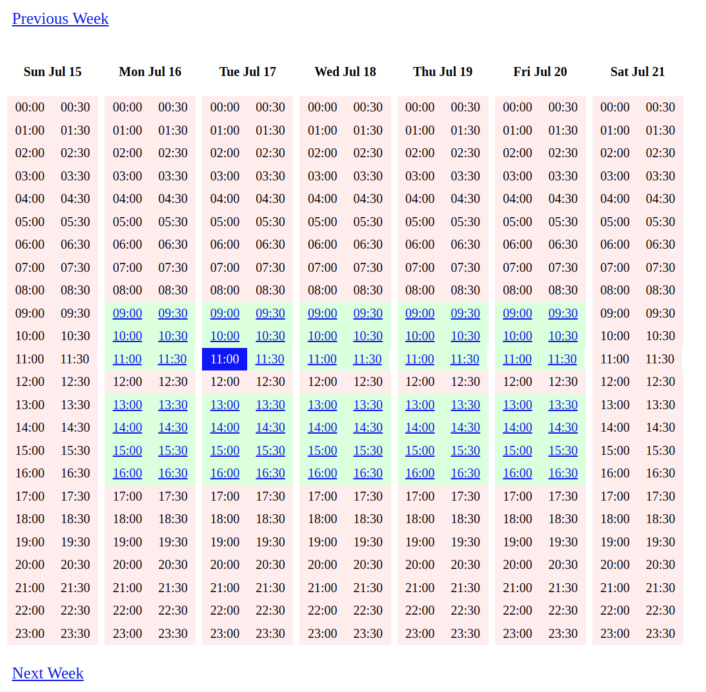

## React vs Go Templates

A simple application for making appointments, developed both as a React SPA and a traditional server-side solution with Go HTML templates. The two implementations are then compared on the basis of lines of code, development time, and runtime performance.

